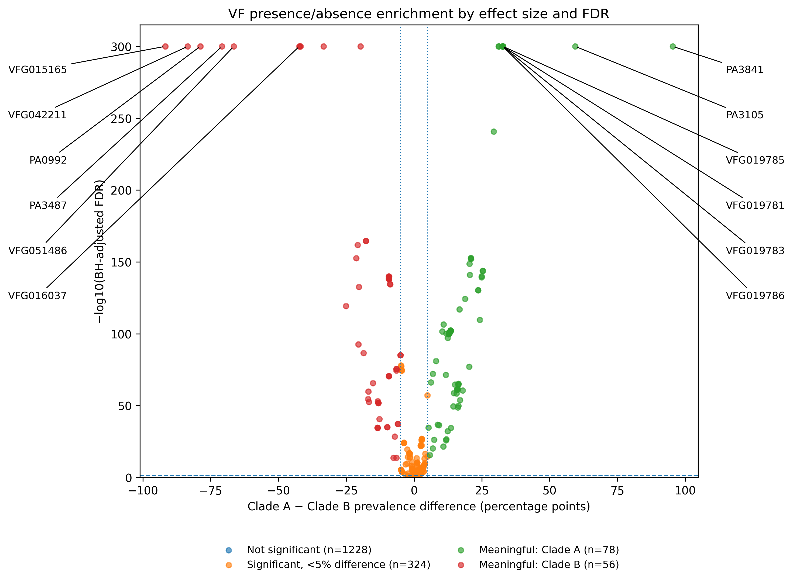

# VF Presence/Absence and Pangenome Analysis

This folder contains scripts used to calculate VF frequencies, map VF entries to PAO1 locus tags, remove redundant VF entries, test for differences in VF presence/absence between Clade A and Clade B, and visualize the enrichment results.

## Run Order

### 1. `raw_vfdb_frequency.R`

Run this script first.

It calculates the frequency of each VF accession in Clade A and Clade B.

Main output:

`raw_vfdb_frequency.csv`

---

### 2. `locus_tag.py`

Run this script second.

Input:

`raw_vfdb_frequency.csv`

This script maps VFDB protein accessions to PAO1 locus tags. It first attempts direct mapping using NCBI protein annotations. Entries that cannot be mapped directly are mapped using BLASTP against the PAO1 proteome.

Required reference files:

`GCF_000006765.1_ASM676v1_protein.faa`

`GCF_000006765.1_ASM676v1_genomic.gff`

Main output:

`raw_vfdb_frequency_with_locus_tag.csv`

---

### 3. `raw_vfdb_frequency_nonredundant.R`

Run this script third.

Input:

`raw_vfdb_frequency_with_locus_tag.csv`

Some different VFDB accessions map to the same locus tag. This script keeps one representative VF for each mapped locus tag, primarily based on the highest combined genome coverage across the two clades.

VFs without a mapped locus tag are retained individually.

Main outputs:

`VF_representative_list_one_per_locus.csv`

`raw_vfdb_frequency_nonredundant.csv`

`VF_discarded_repeated_locus_entries.csv`

---

### 4. `pangenome_analysis.R`

Run this script fourth.

Input:

`raw_vfdb_frequency_nonredundant.csv`

This script compares VF presence/absence between Clade A and Clade B using Fisher's exact test.

It calculates:

- VF frequency in each clade
- frequency difference between clades
- odds ratio
- Fisher's exact test p-value
- Benjamini-Hochberg FDR
- enriched clade

A VF is considered meaningfully enriched when:

`FDR <= 0.05`

and

`absolute frequency difference >= 0.05`

Main outputs:

`VF_presence_absence_enrichment_Clade_A_vs_B_all.csv`

`VF_presence_enriched_in_Clade_A.csv`

`VF_presence_enriched_in_Clade_B.csv`

`VF_statistically_significant_small_difference.csv`

`VF_enrichment_without_locus_tag.csv`

---

### 5. `plot.py`

Run this script last.

Input:

`VF_presence_absence_enrichment_Clade_A_vs_B_all.csv`

This script generates a volcano-style plot showing VF presence/absence enrichment between Clade A and Clade B.

The x-axis shows the prevalence difference:

`Clade A - Clade B`

The y-axis shows:

`-log10(BH-adjusted FDR)`

The plot separates VFs into:

- not significant
- statistically significant but <5% prevalence difference
- meaningfully enriched in Clade A
- meaningfully enriched in Clade B

Main output:

`VF_enrichment_effect_size_FDR_volcano.png`

## Workflow

### Step 1

`raw_vfdb_frequency.R`

↓

`raw_vfdb_frequency.csv`

### Step 2

`locus_tag.py`

↓

`raw_vfdb_frequency_with_locus_tag.csv`

### Step 3

`raw_vfdb_frequency_nonredundant.R`

↓

`raw_vfdb_frequency_nonredundant.csv`

### Step 4

`pangenome_analysis.R`

↓

`VF_presence_absence_enrichment_Clade_A_vs_B_all.csv`

### Step 5

`plot.py`

↓

`VF_enrichment_effect_size_FDR_volcano.png`

## Enrichment Plot

