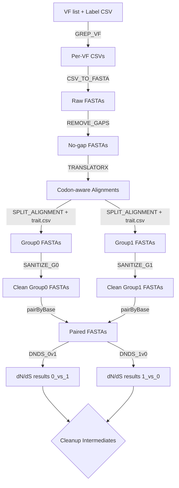

````markdown
# dN/dS Groupwise Workflow

This Nextflow pipeline automates the calculation of **groupwise dN/dS ratios** for gene families across two groups of sequences. It takes virulence factor (VF) lists and reference CSVs, generates codon-aware alignments, splits them by traits, sanitizes inputs, and computes groupwise dN/dS values in both directions.

---

## Features

- Extracts per-VF sequence sets from a label CSV (`GREP_VF`)
- Converts per-VF CSVs to FASTA (`CSV_TO_FASTA`)
- Removes gap-only residues to clean FASTAs (`REMOVE_GAPS`)
- Runs codon-aware alignment using **TranslatorX**
- Splits alignments into groups based on a trait file (`SPLIT_ALIGNMENT`)
- Sanitizes FASTAs for downstream compatibility
- Pairs group0 vs group1 FASTAs
- Runs groupwise dN/dS in both directions:
  - `DNDS_0v1`: group0 vs group1  
  - `DNDS_1v0`: group1 vs group0
- Cleans up intermediate outputs, leaving only final dN/dS results

---

## Requirements

- **Nextflow** ≥ 24.10  
- **Python 3** with dependencies used in:
  - `alignment.py`
  - `split_alignment.py`
  - `two_mode_test.py`
- **TranslatorX** (`translatorx_vLocal.pl`) available on `$PATH`
- Bash + standard Unix tools (grep, awk, etc.)
- Optionally, set up your own environment for sanitization script (`sanitize_fasta.sh`)

> ⚠️ The pipeline assumes `translatorx_vLocal.pl` and Python scripts are callable in your environment. Conda is disabled in this workflow.

---

## Input Files

1. **VF list**: CSV file containing VF IDs (`core_VF.csv`)  
2. **Label CSV**: Mapping of VF IDs to sequences (`vfdb_95_output.csv`)  
3. **Trait file**: CSV mapping sequences to groups (`trait.csv`)  
4. **Python/Bash helper scripts**:  
   - `alignment.py`
   - `split_alignment.py`
   - `two_mode_test.py`
   - `sanitize_fasta.sh`

---

## Usage

Clone or copy this workflow and run:

```bash
nextflow run main.nf -c nextflow.config
````

By default, paths are configured in `main.nf`:

```groovy
params.work_dir       = '/data1/B_Li/vfdb/workflow_clade'
params.vf_list        = "${params.work_dir}/core_VF.csv"
params.label_csv      = '/data1/B_Li/vfdb/vfdb_95_output.csv'
params.align_script   = "${params.work_dir}/alignment.py"
params.trait_file     = "${params.work_dir}/trait.csv"
params.split_script   = "${params.work_dir}/split_alignment.py"
params.dnds_script    = "${params.work_dir}/two_mode_test.py"
params.sanitize_script = '/data1/B_Li/vfdb/workflow/sanitize_fasta.sh'
```

You can override these parameters with `-params-file` or `--param value`.

---

## Output

Final results are saved under:

```
<work_dir>/dnds_output/
├── 0_vs_1/
│   ├── <gene>_0v1_groupwise_dnds.csv
│   └── ...
└── 1_vs_0/
    ├── <gene>_1v0_groupwise_dnds.csv
    └── ...
```

All intermediate files (`fastas`, `final_aln`, `sanitized`, etc.) are **removed automatically** by `CLEANUP_OUTPUTS`.
Reports are also generated:

```
<work_dir>/.reports/
├── timeline.html
├── trace.txt
└── report.html
```

---

## Workflow Outline



---

## Notes

* Adjust CPU counts per process in `main.nf` depending on your system.
* Intermediate cleanup leaves only the `dnds_output` directory.
* To keep intermediates for debugging, comment out or disable the `CLEANUP_OUTPUTS` process.

---

## Citation

If you use this workflow in a publication, please cite:
*Your lab, your institution, and/or the relevant scripts/tools (TranslatorX, Nextflow).*

---

```

---

Do you want me to also include **an example trait.csv format** (like `SampleID,Group` → `sample1,0` / `sample2,1`) in the README?
```

