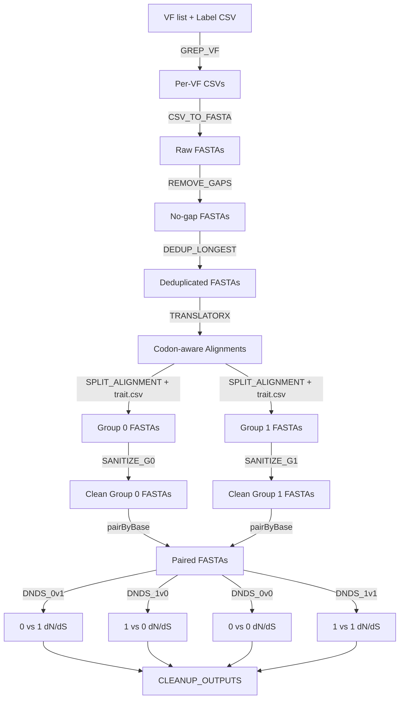

# 🧬 dN/dS Groupwise Workflow

This **Nextflow DSL2** pipeline automates the calculation of **groupwise dN/dS ratios** for gene families across two sequence groups.  
It processes virulence factor (VF) lists and sequence mappings, generates codon-aware alignments, splits by traits, sanitizes FASTAs, and computes dN/dS in **four directions**.

---

## ✨ Features

- Extracts per-VF sequence sets from a label CSV (`GREP_VF`)
- Converts per-VF CSVs to FASTA (`CSV_TO_FASTA`)
- Removes gap-only residues (`REMOVE_GAPS`)
- Deduplicates by header, keeping longest sequence (`DEDUP_LONGEST`)
- Runs codon-aware alignments with **TranslatorX**
- Splits alignments into groups by trait (`SPLIT_ALIGNMENT`)
- Sanitizes FASTAs for downstream analysis
- Pairs Group 0 and Group 1 FASTAs (`pairByBase`)
- Computes **groupwise dN/dS** in four directions:
  - `DNDS_0v1`: Group 0 vs Group 1  
  - `DNDS_1v0`: Group 1 vs Group 0  
  - `DNDS_0v0`: Group 0 internal comparison  
  - `DNDS_1v1`: Group 1 internal comparison
- Cleans up intermediate folders automatically (`CLEANUP_OUTPUTS`)

---

## 🧩 Requirements

- **Nextflow ≥ 24.10**
- **Python 3** with dependencies used in:
  - `alignment.py`
  - `split_alignment.py`
  - `two_mode_test.py`
  - `dedup_longest.py`
- **TranslatorX** (`translatorx_vLocal.pl`) available on `$PATH`
- Bash + standard Unix tools (grep, awk, etc.)
- Optional: your own `sanitize_fasta.sh` script for FASTA header cleaning

> ⚠️ Conda environments are **disabled** — ensure `translatorx_vLocal.pl` and Python scripts are callable in your environment.

---

## 📂 Input Files

1. **VF list** — CSV file with VF IDs (e.g., `core_VF.csv`)  
2. **Label CSV** — sequence mapping file (e.g., `vfdb_95_output.csv`)  
3. **Trait file** — CSV mapping sequence names to groups (e.g., `trait.csv`)  
4. **Helper scripts** — must be accessible by path:
   - `alignment.py`
   - `split_alignment.py`
   - `two_mode_test.py`
   - `dedup_longest.py`
   - `sanitize_fasta.sh`

---

## 🚀 Usage

Clone or copy this workflow and run:

```bash
nextflow run main.nf -c nextflow.config
````

By default, paths are configured inside `main.nf`:

```groovy
params.work_dir        = '/YOUR/WORK/DIR'
params.vf_list         = "${params.work_dir}/core_VF.csv"
params.label_csv       = '/PATH/TO/BLAST_OUTPUT.csv'
params.align_script    = "${params.work_dir}/alignment.py"
params.trait_file      = "${params.work_dir}/trait.csv"
params.split_script    = "${params.work_dir}/split_alignment.py"
params.dnds_script     = "${params.work_dir}/two_mode_test.py"
params.dedup_script    = "${params.work_dir}/dedup_longest.py"
params.sanitize_script = '/data1/B_Li/vfdb/workflow/sanitize_fasta.sh'
```

You can override parameters using:

```bash
nextflow run main.nf --work_dir /path/to/workdir --vf_list core_VF.csv
```

or provide a `.json`/`.yml` with `-params-file`.

---

## 📊 Output Structure

Final results are stored under:

```
<work_dir>/dnds_output/
├── 0_vs_1/
│   ├── <gene>_0v1_groupwise_dnds.csv
│   └── ...
├── 1_vs_0/
│   ├── <gene>_1v0_groupwise_dnds.csv
│   └── ...
├── 0_vs_0/
│   ├── <gene>_0v0_groupwise_dnds.csv
│   └── ...
└── 1_vs_1/
    ├── <gene>_1v1_groupwise_dnds.csv
    └── ...
```

Intermediate directories (e.g., `VFs`, `fastas`, `final_aln`, `sanitized`) are automatically deleted after success.
To debug, comment out the `CLEANUP_OUTPUTS` process.

Nextflow also produces reports:

```
<work_dir>/.reports/
├── report.html
├── timeline.html
└── trace.txt
```

---

## 🧠 Workflow Overview



---

## ⚙️ Notes

* Adjust CPU allocation per process to match your cluster.
* The workflow can be parallelized across genes or VFs.
* `CLEANUP_OUTPUTS` preserves only the final `dnds_output` directory.
* To keep intermediates, disable or comment out that process.
* Ensure all Python helper scripts are executable and use `#!/usr/bin/env python3`.

---

**Author:** Boxuan Li
**Lab:** Brown Lab, Georgia Tech
**Version:** v2.0 (Updated for DEDUP_LONGEST and internal comparisons)
