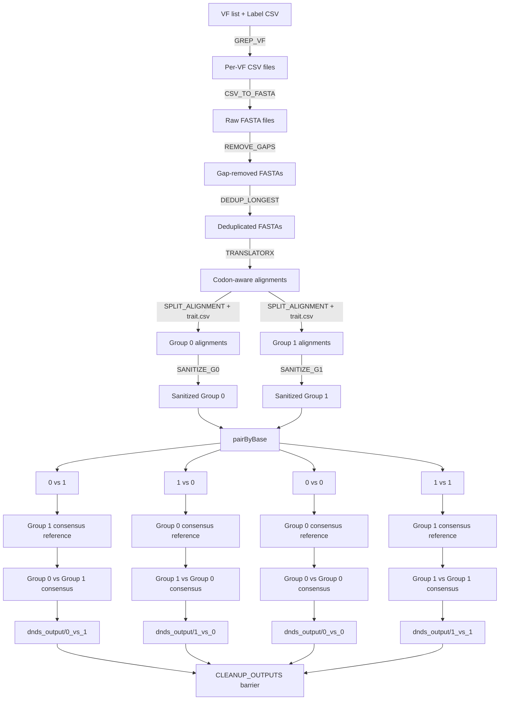

# dN/dS Groupwise Workflow

This **Nextflow DSL2** workflow calculates groupwise dN/dS values for virulence factor (VF) genes across two sequence groups.

The workflow extracts VF sequences, converts them to FASTA, removes gaps and duplicate sequence entries, performs codon-aware alignment with TranslatorX, splits the alignments into two groups according to a trait file, sanitizes the alignments, and calculates dN/dS in four comparison directions.

> **Important:** If redundant VF entries have been identified by locus-tag mapping, perform the locus-tag filtering / representative-VF selection first and use the resulting nonredundant VF list as `params.vf_list` before running this workflow.

---

## Overview

For each VF gene, the workflow performs:

1. Extract sequences belonging to the VF
2. Convert the extracted CSV to FASTA
3. Remove gaps from the raw sequences
4. Deduplicate sequences by header
5. Perform codon-aware alignment with TranslatorX
6. Split the alignment into Group 0 and Group 1
7. Sanitize both group alignments
8. Match Group 0 and Group 1 FASTAs by VF ID
9. Generate a consensus reference from the appropriate group
10. Calculate groupwise dN/dS in four directions

The four comparisons are:

* `0_vs_1`: Group 0 sequences compared against the **Group 1 consensus**
* `1_vs_0`: Group 1 sequences compared against the **Group 0 consensus**
* `0_vs_0`: Group 0 sequences compared against the **Group 0 consensus**
* `1_vs_1`: Group 1 sequences compared against the **Group 1 consensus**

The workflow does **not** use PAO1 or PA14 as the reference. References are generated directly from the corresponding group alignments using `--consensus`.

---

## Workflow Steps

### 1. `GREP_VF`

Reads the first column of the VF list and extracts matching entries from the VFDB sequence mapping table.

Input:

* `core_VF.csv` or another VF list
* `vfdb_95_output.csv`

Output:

`VFs/<VFG_ID>.csv`

---

### 2. `CSV_TO_FASTA`

Converts each per-VF CSV file into an unaligned FASTA file using `alignment.py`.

Output directory:

`fastas/`

---

### 3. `REMOVE_GAPS`

Removes `-` characters from sequence lines while preserving FASTA headers.

If no sequence residues remain after gap removal, that VF is skipped.

Output directory:

`fastas_nogap/`

Example:

`VFG000115.nogap.fasta`

---

### 4. `DEDUP_LONGEST`

Uses `dedup_longest.py` to remove duplicate sequence headers.

When multiple sequences have the same header, the longest sequence is retained.

Output directory:

`fastas_dedup/`

Example:

`VFG000115.nogap.dedup.fasta`

---

### 5. `TRANSLATORX`

Runs TranslatorX to generate a codon-aware nucleotide alignment for each VF.

The workflow uses bacterial genetic code 11:

`translatorx_vLocal.pl -p F -t F -c 11`

Output directory:

`final_aln/`

Example structure:

`final_aln/VFG000115.nogap.dedup/VFG000115.nogap.dedup.nt_ali.fasta`

These intermediate alignments are also useful for downstream sequence-level analyses.

---

### 6. `SPLIT_ALIGNMENT`

Uses `split_alignment.py` and `trait.csv` to divide each alignment into two groups.

Outputs:

`0_splitted_aln/`

`1_splitted_aln/`

The biological meaning of Group 0 and Group 1 depends on the labels provided in `trait.csv`.

---

### 7. `SANITIZE_G0` and `SANITIZE_G1`

Runs `sanitize_fasta.sh` separately on Group 0 and Group 1 alignments.

Empty FASTA files are skipped.

Outputs:

`sanitized/g0/`

`sanitized/g1/`

---

### 8. `pairByBase`

Matches Group 0 and Group 1 FASTA files using their basename so that the corresponding VF alignments are analyzed together.

For example:

`VFG000115` Group 0

is paired with:

`VFG000115` Group 1

---

## dN/dS Comparisons

### `DNDS_0v1`

Target:

Group 0 alignment

Reference alignment:

Group 1

Command structure:

`two_mode_test.py groupwise G0.fasta G1.fasta --consensus`

The consensus sequence generated from Group 1 is used as the reference for all Group 0 sequences.

Output:

`dnds_output/0_vs_1/`

---

### `DNDS_1v0`

Target:

Group 1 alignment

Reference alignment:

Group 0

Command structure:

`two_mode_test.py groupwise G1.fasta G0.fasta --consensus`

The Group 0 consensus is used as the reference.

Output:

`dnds_output/1_vs_0/`

---

### `DNDS_0v0`

Target:

Group 0 alignment

Reference alignment:

Group 0

Command structure:

`two_mode_test.py groupwise G0.fasta G0.fasta --consensus`

The Group 0 consensus is used to measure within-Group-0 dN/dS.

Output:

`dnds_output/0_vs_0/`

---

### `DNDS_1v1`

Target:

Group 1 alignment

Reference alignment:

Group 1

Command structure:

`two_mode_test.py groupwise G1.fasta G1.fasta --consensus`

The Group 1 consensus is used to measure within-Group-1 dN/dS.

Output:

`dnds_output/1_vs_1/`

---

## Consensus Reference

Because every dN/dS process is called with:

`--consensus`

`two_mode_test.py` derives a consensus sequence from the supplied reference alignment rather than using a specific genome or strain.

The consensus is generated from the multiple sequence alignment and is then used as the single reference sequence for the groupwise comparisons. 

In the current implementation, the consensus uses a threshold of `0.7`, with unresolved positions represented as `N`. 

---

## dN/dS Calculation

For each target sequence, `two_mode_test.py` compares it against the consensus reference and calculates:

* `dN`
* `dS`
* `dN/dS`

using the **NG86** method. 

The output columns are:

`Ref`

`Seq`

`dN`

`dS`

`dN/dS`


Special cases:

* `dS > 0` → `dN/dS = dN / dS`
* `dS = 0` and `dN > 0` → `dN/dS = inf`
* `dS = 0` and `dN = 0` → `dN/dS = 0`

---

## Sequence Processing During dN/dS Calculation

Before calculating dN/dS, `two_mode_test.py` performs additional pair-specific cleaning.

It:

* handles sequences marked with `_R_` by reverse-complementing them
* removes shared gap codons
* resolves ambiguous nucleotide positions
* removes stop codons
* removes codons containing gaps
* preserves the codon reading frame

 

---

## Requirements

* Nextflow with DSL2 support
* Python 3
* Biopython
* tqdm
* TranslatorX (`translatorx_vLocal.pl`)
* Perl and dependencies required by TranslatorX
* Bash
* awk
* grep
* cut

Helper scripts:

* `alignment.py`
* `dedup_longest.py`
* `split_alignment.py`
* `sanitize_fasta.sh`
* `two_mode_test.py`

All required programs and scripts should be accessible from the environment in which Nextflow is run.

---

## Input Files

### VF list

Example:

`core_VF.csv`

The first column should contain the VF identifiers used to search the label CSV.

---

### Label CSV

Example:

`vfdb_95_output.csv`

Contains the VFDB sequence mappings used to extract sequences for individual VF genes.

---

### Trait file

Example:

`trait.csv`

Maps sequence/genome identifiers to Group 0 or Group 1.

---

## Configuration

Example configuration:

```
params.work_dir        = '/data2/B_Li/vfdb/workflow_clade_translatorX_solved_dup_solved'
params.vf_list         = "${params.work_dir}/core_VF.csv"
params.label_csv       = '/data2/B_Li/vfdb/vfdb_95_output.csv'
params.align_script    = "${params.work_dir}/alignment.py"
params.dedup_script    = "${params.work_dir}/dedup_longest.py"
params.trait_file      = "${params.work_dir}/trait.csv"
params.split_script    = "${params.work_dir}/split_alignment.py"
params.dnds_script     = "${params.work_dir}/two_mode_test.py"
params.sanitize_script = "${params.work_dir}/sanitize_fasta.sh"
```

Modify these paths before running the workflow on another system.

---

## Usage

Run the workflow with:

```
nextflow run main.nf -c nextflow.config
```

To resume a partially completed run:

```
nextflow run main.nf -c nextflow.config -resume
```

---

## Output Structure

The main dN/dS results are written to:

```
<work_dir>/dnds_output/
├── 0_vs_0/
│   └── *_groupwise_dnds.csv
├── 0_vs_1/
│   └── *_groupwise_dnds.csv
├── 1_vs_0/
│   └── *_groupwise_dnds.csv
└── 1_vs_1/
    └── *_groupwise_dnds.csv
```

Interpretation:

```
0_vs_0 = Group 0 vs Group 0 consensus
0_vs_1 = Group 0 vs Group 1 consensus
1_vs_0 = Group 1 vs Group 0 consensus
1_vs_1 = Group 1 vs Group 1 consensus
```

Intermediate output directories include:

```
VFs/
fastas/
fastas_nogap/
fastas_dedup/
final_aln/
0_splitted_aln/
1_splitted_aln/
sanitized/
```

Nextflow reports are written to:

```
.reports/
├── report.html
├── timeline.html
└── trace.txt
```

---

## Workflow Flow Chart


```mermaid
flowchart TD

    A[VF list + Label CSV] -->|GREP_VF| B[Per-VF CSV files]

    B -->|CSV_TO_FASTA| C[Raw FASTA files]

    C -->|REMOVE_GAPS| D[Gap-removed FASTAs]

    D -->|DEDUP_LONGEST| E[Deduplicated FASTAs]

    E -->|TRANSLATORX| F[Codon-aware alignments]

    F -->|SPLIT_ALIGNMENT + trait.csv| G0[Group 0 alignments]
    F -->|SPLIT_ALIGNMENT + trait.csv| G1[Group 1 alignments]

    G0 -->|SANITIZE_G0| H0[Sanitized Group 0]
    G1 -->|SANITIZE_G1| H1[Sanitized Group 1]

    H0 --> P[pairByBase]
    H1 --> P

    P --> C01[0 vs 1]
    P --> C10[1 vs 0]
    P --> C00[0 vs 0]
    P --> C11[1 vs 1]

    C01 --> R01[Group 1 consensus reference]
    R01 --> D01[Group 0 vs Group 1 consensus]

    C10 --> R10[Group 0 consensus reference]
    R10 --> D10[Group 1 vs Group 0 consensus]

    C00 --> R00[Group 0 consensus reference]
    R00 --> D00[Group 0 vs Group 0 consensus]

    C11 --> R11[Group 1 consensus reference]
    R11 --> D11[Group 1 vs Group 1 consensus]

    D01 --> O01[dnds_output/0_vs_1]
    D10 --> O10[dnds_output/1_vs_0]
    D00 --> O00[dnds_output/0_vs_0]
    D11 --> O11[dnds_output/1_vs_1]

    O01 --> Z[CLEANUP_OUTPUTS barrier]
    O10 --> Z
    O00 --> Z
    O11 --> Z
```

---

## Simplified Comparison Design

```
Group 0 alignment ───────────────┐
                                ├── 0_vs_0
Group 0 consensus ──────────────┘

Group 0 alignment ───────────────┐
                                ├── 0_vs_1
Group 1 consensus ──────────────┘


Group 1 alignment ───────────────┐
                                ├── 1_vs_1
Group 1 consensus ──────────────┘

Group 1 alignment ───────────────┐
                                ├── 1_vs_0
Group 0 consensus ──────────────┘
```

---

## Important Notes

### Consensus-based comparison

This workflow specifically uses the **consensus method** for all four dN/dS comparisons.

It does not use:

* PAO1 reference
* PA14 reference
* most-frequent-sequence reference
* IQ-TREE ancestral reference

although `two_mode_test.py` supports the latter two alternatives when used separately. 

### Intermediate files

The `final_aln` directory contains the codon-aligned FASTA files and may be required for downstream analyses such as sequence heterogeneity tests.

Therefore, keep the intermediate files if those analyses still need to be performed.

### Cleanup warning

In the current workflow code, the `rm -rf` cleanup command is commented/disabled. Therefore, the intermediate output folders are **not intentionally removed by the current version**.

If cleanup is later enabled, make sure the entire `rm -rf` block is uncommented correctly rather than only uncommenting its first line.

### Conda configuration

The provided configuration currently contains both:

```
conda {
  enabled = false
}
```

and later:

```
conda {
  enabled = true
}
```

This should be cleaned up so that only the intended setting remains. The workflow itself does not define dedicated Conda environments for these helper processes, so the required tools should be available in the execution environment.

---

**Version:** v1.1 — consensus-based four-direction groupwise dN/dS workflow.
